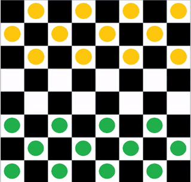
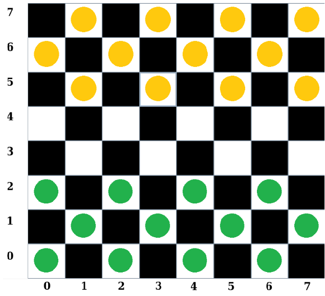

# SmartChecker


- Checker Game developed using minimax and alpha-beta pruning algorithm.
- Project as part of IF3170 Artificial Intelligence Course at Bandung Institute of Technology.
- Submitted on October 2th, 2019.

## How to Run:
  There are 2 programs:
1. Checker Program without AI\
   Build the program:
  ```javac Gameplay.java```\
   Run the application:
   ```java Gameplay```
2. Checker Program with AI\
   Build the program:
  ```javac GameplayAlphaBeta.java```\
   Run the application:
   ```java GameplayAlphaBeta```

## Gameplay Guide
This is the checker board:\


Each turn the user will be asked to input the next move they pick, for example the user want to move the piece from (0,2) to (1,3), the input will be:
```
0
2
1
3
```
Each separated by ```Enter```.\
If the move is considered illegal, the user will need to input again from the start.\
The game finish when either side don't have single piece anymore.
